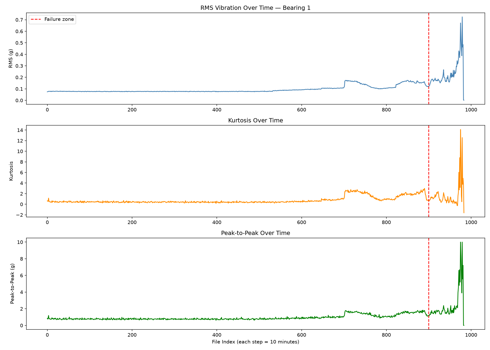
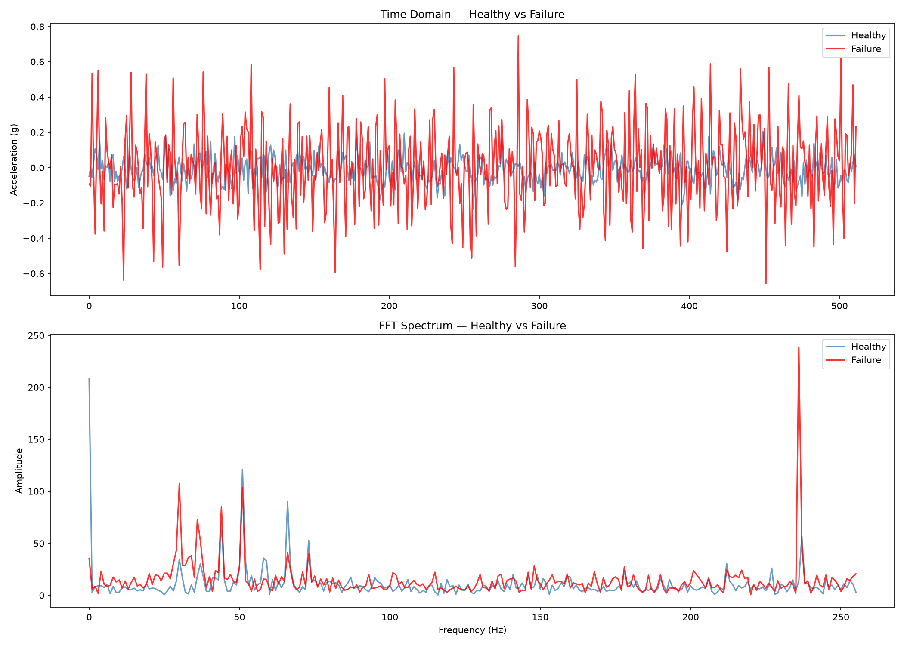
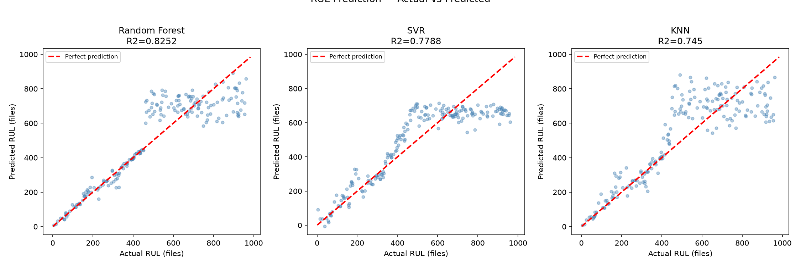
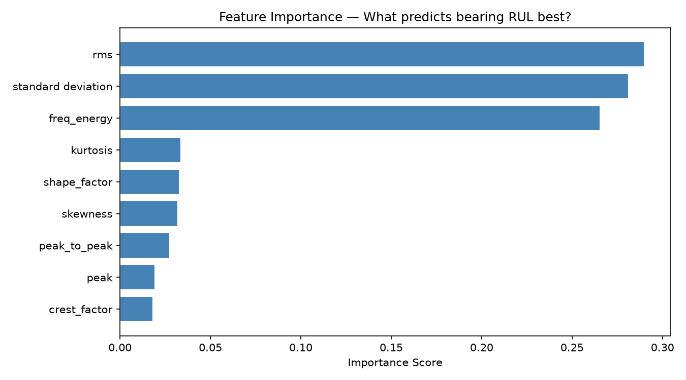

# BEARING-RUL-PREDICTION
Remaining Useful Life (RUL) prediction of rolling element bearings using vibration signal analysis, feature engineering, FFT-based features, and machine learning models (Random Forest, SVR, KNN) on the NASA IMS bearing dataset.
# NASA IMS Bearing — Remaining Useful Life (RUL) Prediction

## Project Overview
This project predicts the Remaining Useful Life (RUL) of industrial 
bearings using vibration signal analysis and machine learning. 
Unlike common bearing fault detection projects that use artificially 
induced faults (CWRU dataset), this project uses NASA IMS run-to-failure 
data where bearings naturally degraded over 7 days of continuous 
operation until actual failure.

The goal is to predict how many minutes remain before a bearing fails — 
enabling maintenance teams to schedule intervention before failure 
occurs rather than reacting after it.

---

## Dataset
**Source:** NASA Prognostics Data Repository — IMS Bearing Dataset  
**Collected by:** Center for Intelligent Maintenance Systems (IMS), 
University of Cincinnati  
**Test set used:** 2nd_test — 984 files, 4 bearings, 
recorded every 10 minutes  
**Sampling frequency:** 20,480 Hz  
**Failure event:** Outer race failure in Bearing 1  
**Duration:** February 12, 2004 to February 19, 2004 (7 days)

Each file contains 20,480 vibration samples — one second of 
high-frequency accelerometer data per bearing channel.

---

## Bearing Physics — Why These Features Matter

Bearing failure follows a predictable degradation pattern:

**Stage 1 (files 0–700):** Normal operation. RMS ~0.07g, 
kurtosis ~1.0. Surface intact, vibration is random noise.

**Stage 2 (files 700–900):** Early degradation. RMS rises to 0.15g. 
Kurtosis increases slightly. Micro-cracks forming on outer race.

**Stage 3 (files 900–984):** Rapid failure. RMS spikes to 0.7g. 
Kurtosis peaks at 14. Peak-to-peak reaches 9g. 
Outer race surface breaking down — impact events at each 
ball pass frequency.

This physical understanding drove the choice of features — 
each feature captures a different aspect of bearing health:

|       Feature      |                 Physical Meaning                        |
|--------------------|---------------------------------------------------------|
|       RMS          | Overall vibration energy — rises as surface degrades    |
|     Kurtosis       | Impulsiveness — spikes when bearing impacts occur       |
|    Crest Factor    | Ratio of peak to RMS — detects early impact events      |
|    Peak-to-Peak    | Total amplitude range — rises dramatically near failure |
|    Skewness        | Signal asymmetry — healthy bearings are symmetric       |
|    Shape Factor    | Waveform shape — changes as damage progresses           |
|    Freq Energy     | Total FFT energy — broadband increase indicates damage  |
| Standard Deviation | Signal spread — correlated with damage severity         |

---

## Methodology

### Step 1 — Data Exploration
Loaded all 984 files, verified structure (20480 × 4), 
confirmed Bearing 1 as the failing channel.

### Step 2 — Feature Extraction
Extracted 8 time-domain and frequency-domain features from 
every file's Bearing 1 signal. Each file becomes one row 
in the feature matrix. RUL label assigned as 
`total_files - file_index`.

### Step 3 — Signal Visualization
Plotted degradation timeline for RMS, Kurtosis, and 
Peak-to-Peak over all 984 files. Clear three-stage 
degradation pattern visible — flat healthy region, 
gradual rise, catastrophic spike before failure.

### Step 4 — FFT Analysis
Compared frequency spectrum of healthy signal (file 0) 
vs failure zone signal (file 960). Key observations:
- Failure signal shows 3× higher time-domain amplitude
- New frequency peak at ~240 Hz in failure signal 
  — corresponds to outer race ball pass frequency
- Broadband energy increase in failure signal 
  — classic signature of surface damage

### Step 5 — RUL Prediction
Three regression models trained and compared:

| Model | MAE (files) | MAE (hours) | R2 Score |
|-------|------------|-------------|---------|
| Random Forest | 74.4 | 12.4 hrs | 0.8252 |
| SVR | 94.9 | 15.8 hrs | 0.7788 |
| KNN | 96.2 | 16.0 hrs | 0.7450 |

**Random Forest performed best** — R2 of 0.825 means the model 
explains 82.5% of variance in remaining useful life.

---

## Key Results

*Three-stage bearing degradation clearly visible across 
all features*

*Healthy vs failure zone FFT — new fault frequency peak 
visible at ~240 Hz in failure signal*

*Random Forest predicts RUL within 12.4 hours mean error 
across 984 files*

*RMS, standard deviation, and frequency energy dominate — 
confirming energy-based features best capture degradation*

---

## Honest Limitations

**Temporal data leakage:** Random train-test split yields 
R2=0.825 but TimeSeriesSplit evaluation reveals R2 of -10, 
indicating the model interpolates well within the dataset 
but cannot generalize to unseen late-stage degradation 
patterns. This is a known fundamental challenge in 
prognostic modeling.

**Single bearing failure:** Only one failure event available 
in this test set. More failure runs needed for robust 
generalization.

**Fixed operating conditions:** Dataset collected at constant 
2000 RPM and 6000 lbs load. Real factory bearings operate 
under variable conditions — model would need retraining 
for different operating points.

**Industrial solution:** Real predictive maintenance systems 
address temporal leakage through continuous online model 
retraining as new operational data arrives — the model 
updates itself every shift.

---

This pipeline converts raw vibration data into actionable 
maintenance decisions — shifting from reactive 
(fix after failure) to predictive (fix before failure) 
maintenance strategy.

---

## What I Learned

- Signal processing: FFT frequency analysis, 
  time-domain feature engineering
- The physical meaning behind each statistical feature 
  and why it captures bearing degradation
- Why temporal data splitting matters for time-series ML 
  and how random splits cause data leakage
- How predictive maintenance integrates into 
  industrial SCADA systems
- Difference between artificially induced faults (CWRU) 
  and naturally degraded bearing data (NASA IMS)

---

## Tools Used
Python 3.12 | NumPy | Pandas | Matplotlib | 
SciPy | Scikit-learn | VS Code

---

## Author
Prashant Gupta — B.Tech Mechanical Engineering, 
Jamia Millia Islamia, New Delhi  
[This pipeline converts raw vibration data into actionable 
maintenance decisions — shifting from reactive 
(fix after failure) to predictive (fix before failure) 
maintenance strategy.

---

## What I Learned

- Signal processing: FFT frequency analysis, 
  time-domain feature engineering
- The physical meaning behind each statistical feature 
  and why it captures bearing degradation
- Why temporal data splitting matters for time-series ML 
  and how random splits cause data leakage
- How predictive maintenance integrates into 
  industrial SCADA systems
- Difference between artificially induced faults (CWRU) 
  and naturally degraded bearing data (NASA IMS)

---

## Tools Used
Python 3.12 | NumPy | Pandas | Matplotlib | 
SciPy | Scikit-learn | VS Code

---

## Author
Raja — B.Tech Mechanical Engineering, 
Jamia Millia Islamia, New Delhi , B.TECH (MECH. ENGG.)
[www.linkedin.com/in/prashant-gupta-7a4387332]  | [pg1232275-byte]
